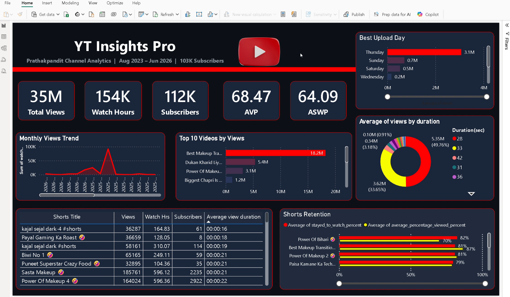

# 📊 YT Insights Pro — YouTube Channel Analytics

## 🎯 Project Overview
End-to-end YouTube analytics project built on real channel 
data — 103K subscribers, 70M+ views, 50+ Shorts analyzed.

## 🛠️ Tech Stack
| Tool | Usage |
|------|-------|
| Python (Pandas, NumPy) | Data Cleaning & EDA |
| XGBoost + Scikit-learn | ML — Video Performance Prediction |
| SQLite (SQL) | Data Querying & Window Functions |
| Excel (OpenPyXL) | Automated Report Generation |
| Power BI | Interactive Dashboard |

## 📈 Key Insights
- 🔥 Best Makeup Transition → 18.2M views (viral Short)
- 📅 Thursday = Best upload day (30x higher avg views)
- ⏱️ Avg retention 76.8% — above Shorts benchmark
- 🤖 XGBoost model predicts video performance tier

## 📁 Files
| File | Description |
|------|-------------|
| yt_insights_pro.py | Main Python Script |
| yt_top_videos.csv | Per video performance data |
| yt_monthly_summary.csv | Monthly aggregated data |
| yt_kpis.csv | Overall channel KPIs |
| YT_Analytics_Report.xlsx | Auto-generated Excel report |
| dashboard.pbix | Power BI Dashboard |

## 👤 Author
**Prakash Pathak** | B.Tech CSE | VIT Bhopal  
YouTube: PrathakPandit (103K Subscribers)
